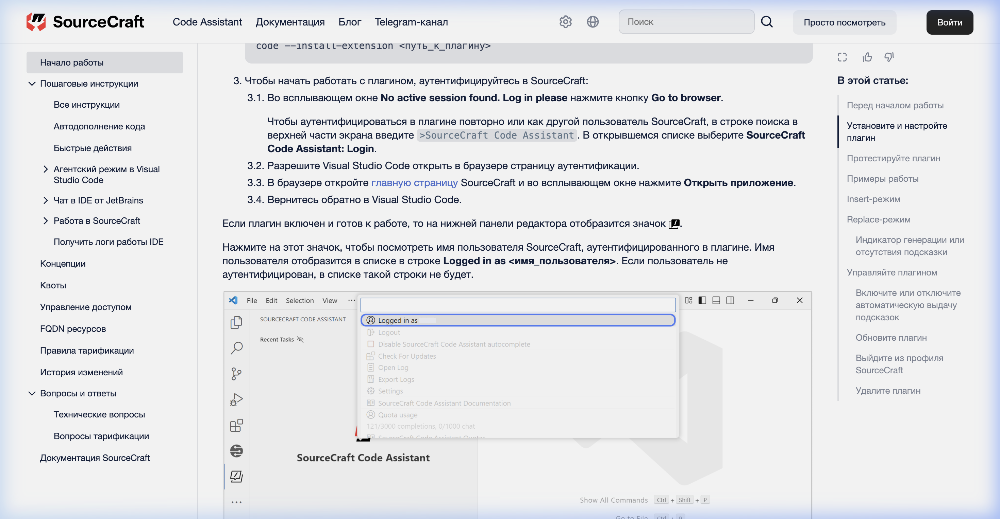
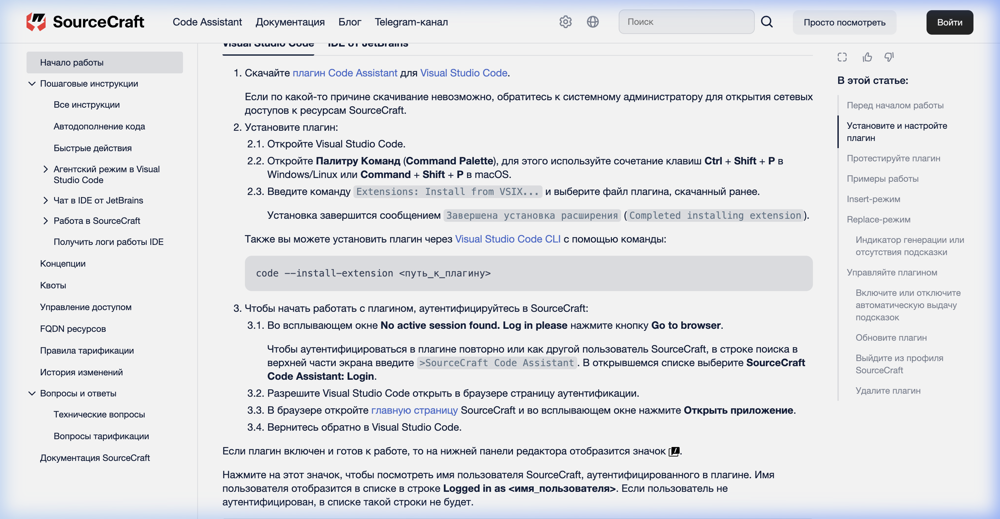
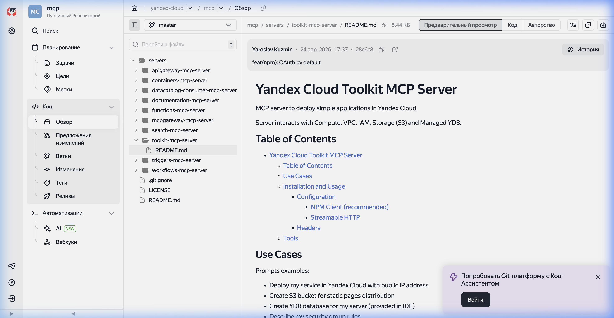
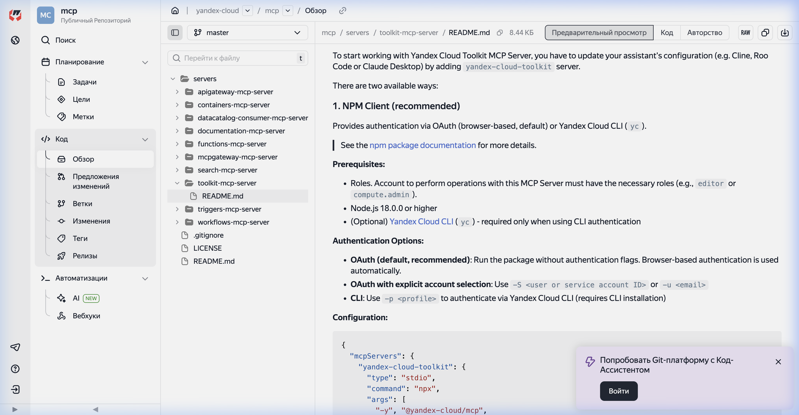
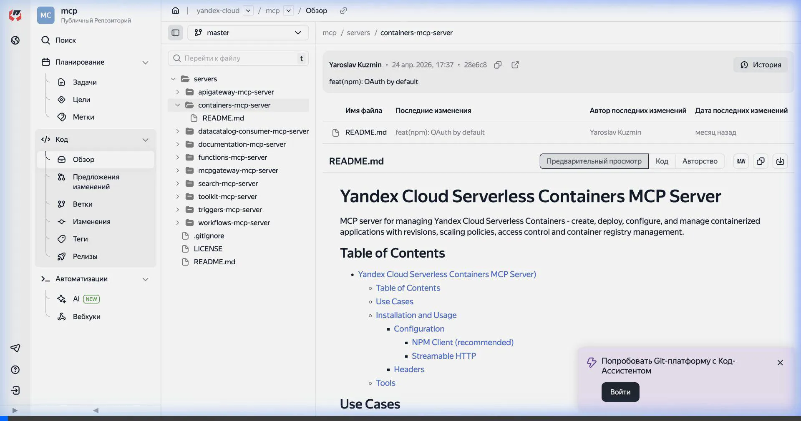

# Отчет по лабораторной работе №12: «Облачные приложения - Yandex.Serverless Applications»

**Выполнил:** Калинин Игорь
**Логин Moodle:** 1167133
**Репозиторий:** [Computer-practic](https://github.com/NerdySnake6/Computer-practic)

---

## 1. Введение
Целью данной работы является освоение процесса создания и развертывания облачных (Serverless) контейнерных приложений в инфраструктуре Yandex Cloud, интеграция среды разработки VSCode с облачными сервисами Yandex Cloud и MCP-серверами (Model Context Protocol), а также разработка веб-приложения на Python с использованием библиотеки Pillow для динамической генерации контента.

---

## 2. Установка и настройка инструментов

### Шаг 1. Установка Yandex SourceCraft Code Assistant
Был скачан файл расширения `.vsix` для VSCode по официальной ссылке. Установка произведена с помощью встроенного интерфейса VSCode:


### Шаг 2. Авторизация расширения
Для включения функций автодополнения кода и взаимодействия с AI-ассистентом было выполнено сопряжение VSCode с профилем Yandex Cloud через OAuth-авторизацию в браузере:


### Шаг 3. Подключение Yandex Cloud Toolkit MCP
Изучена документация MCP-серверов Yandex Cloud. Был настроен Toolkit MCP Server для управления ресурсами облака (инфраструктурой виртуальных машин, СУБД, бакетов):


### Шаг 4. Настройка конфигурационного файла MCP-серверов
В директории настроек IDE был создан/модифицирован файл `mcp_config.json`, в который добавлены команды запуска MCP-серверов `toolkit` и `containers`:


### Шаг 5. Подключение Yandex Cloud Containers MCP
Добавлен и настроен MCP-сервер `containers` для быстрого управления Serverless-контейнерами и реестром образов:


---

## 3. Разработка веб-приложения (Flask + Pillow)

Веб-приложение разработано на языке Python с использованием микрофреймворка Flask. Для демонстрации опыта работы с Pillow реализован роут `/badge`, генерирующий графическую плашку по переданным параметрам.

### Структура проекта:
```
lab12/
├── app.py              # Основной файл Flask приложения
├── Dockerfile          # Спецификация сборки Docker-образа
├── requirements.txt    # Зависимости проекта
├── deploy.sh           # Скрипт автоматизации деплоя
├── templates/
│   └── index.html      # Шаблон главной страницы с CSS-стилями
└── static/             # Папка со скриншотами для отчета
    ├── step1.png
    ├── step2.png
    ├── step3.png
    ├── step4.png
    └── step5.webp
```

---

## 4. Развертывание в Yandex Serverless Containers

Для автоматизации деплоя написан bash-скрипт `deploy.sh`. Он последовательно выполняет следующие задачи:
1. Авторизует Docker в Yandex Container Registry через `yc container registry configure-docker`.
2. Проверяет наличие реестра `flask-app-registry` и создает его при необходимости.
3. Собирает Docker-образ с тегом `cr.yandex/<registry_id>/flask-app:latest`.
4. Загружает (push) образ в созданный реестр.
5. Проверяет наличие контейнера `flask-app-container` в бессерверном окружении Yandex Serverless Containers и создает его.
6. Выполняет деплой новой ревизии на основе загруженного образа (выделяя 1 ядро и 128 МБ ОЗУ).
7. Разрешает неавторизованный (публичный) доступ к контейнеру.
8. Возвращает публичную ссылку на развернутый сервис.

---

## 5. Результаты работы

Приложение успешно развернуто и доступно по сети Интернет.

### Ссылки:
- **Развернутый сервис (главная страница отчета):** https://bbagj5bquilaua21orrg.containers.yandexcloud.net/
- **Роут авторизации (/login):** https://bbagj5bquilaua21orrg.containers.yandexcloud.net/login
